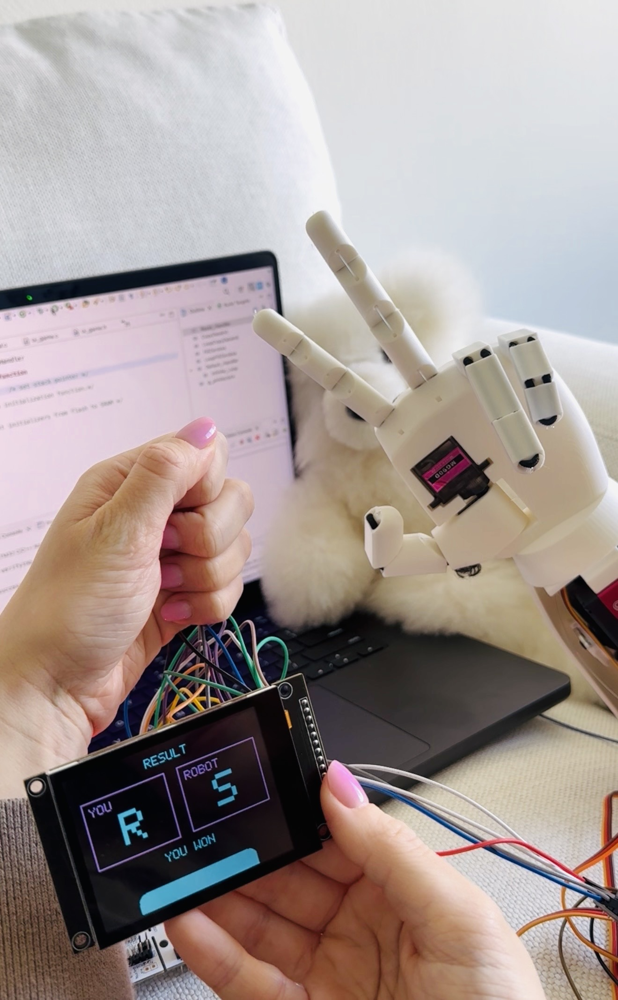

# robotic-hand-rock-paper-scissors
An interactive Rock–Paper–Scissors game where you play against a real robotic hand built entirely on STM32 with custom UI and servo control.

## Project Overview

This project is a physical Rock Paper Scissors game implemented on an STM32 microcontroller and played against a real robotic hand.

The system combines embedded firmware, servo motor control, custom graphical user interface design, and computer vision-based gesture recognition. The STM32 handles all game logic, timing, UI rendering, and robotic hand movement, while a Python application running on a PC detects the user’s hand gestures using a webcam.

Detected gestures (Rock, Paper, or Scissors) are transmitted to the microcontroller via UART over USB, allowing the robotic hand to respond in real time.

The project was built as an end-to-end embedded systems application integrating hardware, firmware, and external vision input.

## Hardware Overview

Below are photos of the physical system used in this project.

The setup combines an embedded STM32 system, custom user interface, robotic actuation, and external computer vision running on a host PC.

### System components

- **STM32F446RE** microcontroller board  
- **2.8" TFT LCD display (320×240, ILI9341)**  
- **Capacitive touch controller (FT6236)**  
- **PCA9685 16-channel PWM servo driver (I2C)**  
- **Multiple servo motors** forming a robotic hand  
- **USB serial connection** between PC and STM32  
- **Webcam** for real-time hand gesture detection  

### Project photos

## Software Stack

This project combines embedded firmware running on an STM32 microcontroller with a host-side computer vision application written in Python.

### Embedded (STM32)

- **Language:** C 
- **Framework:** STM32 HAL
- **IDE:** STM32CubeIDE
- **Microcontroller:** STM32F446RE

**Firmware modules:**

- GPIO configuration  
- SPI driver for TFT display  
- I2C drivers for:
  - FT6236 capacitive touch controller
  - PCA9685 PWM servo driver  
- UART communication using interrupt-based reception  
- Custom graphics rendering engine  
- Game state machine logic  
- Robotic hand control and gesture mapping  

### PC Side (Computer Vision)

- **Language:** Python 3
- **Libraries:**
  - OpenCV
  - MediaPipe
  - PySerial

**Responsibilities:**

- Real-time webcam capture  
- Hand landmark tracking using MediaPipe  
- Gesture classification:
  - Rock
  - Paper
  - Scissors  
- Sending gesture data to STM32 via USB serial  

### Communication

- **Protocol:** UART over USB (CDC)
- **Data format:** single-character commands  
  - `R` → Rock  
  - `P` → Paper  
  - `S` → Scissors  

The STM32 firmware receives gestures asynchronously using UART interrupts and updates the game logic and robotic hand movement in real time.
## How the Game Works

The Rock–Paper–Scissors game is implemented as a real-time interaction between computer vision running on a PC and embedded firmware running on the STM32 microcontroller.

### Step-by-step system flow

1. **Camera input (PC side)**  
   A webcam continuously captures live video frames.

2. **Hand tracking and gesture detection**  
   MediaPipe detects hand landmarks and classifies the gesture as:
   - Rock
   - Paper
   - Scissors

3. **Gesture transmission**  
   When a valid gesture is detected, the Python script sends a single byte over USB serial:

   - `R` → Rock  
   - `P` → Paper  
   - `S` → Scissors  

4. **UART interrupt reception (STM32)**  
   The STM32 receives gesture data using UART interrupts.

   - Incoming bytes are stored in shared variables  
   - The main loop continues running without delays  

5. **Game state machine processing**  
   The firmware processes the game using a state machine:

   - `GAME_HOME` – main menu  
   - `GAME_COUNTDOWN` – 3-2-1 countdown animation  
   - `GAME_WAIT_HAND` – waits for user gesture  
   - `GAME_TRY_AGAIN` – displays results and allows replay  

6. **Robot gesture generation**  
   After the countdown:
   - The robotic hand randomly selects Rock, Paper, or Scissors
   - Servo motors are positioned accordingly using the PCA9685 PWM driver

7. **User gesture evaluation**  
   When the user gesture arrives:
   - The firmware compares player vs robot gestures
   - Game result is calculated:
     - Win
     - Lose
     - Draw

8. **UI rendering on TFT display**  
   The TFT screen displays:
   - Countdown numbers
   - Robot and user moves
   - Final game result
   - Touch-based navigation buttons

9. **Touch input handling**  
   The capacitive touch controller allows the user to:
   - Start the game
   - Return to the home screen
   - Replay another round

10. **Continuous operation**  
    The system runs in a continuous loop with:
    - Non-blocking logic
    - Interrupt-driven input
    - Real-time visual and mechanical feedback
